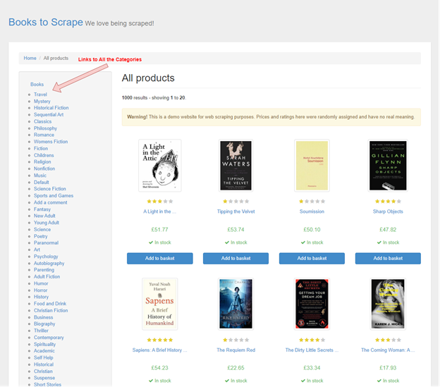

# Web Scraping With PowerShell: The Ultimate Guide

[](https://oxylabs.io/pages/gitoxy?utm_source=877&utm_medium=affiliate&groupid=877&utm_content=web-scraping-powershell-github&transaction_id=102f49063ab94276ae8f116d224b67)`


[](https://discord.gg/GbxmdGhZjq)

[]() []() [](https://github.com/topics/web-scraping)

[PowerShell Core](https://github.com/PowerShell/PowerShell) (an advanced version of Windows PowerShell with open-source and cross-platform properties) is a configuration and automation engine for solving tasks and issues designed by Microsoft. PowerShell and its successors consist of a scripting language with object-oriented support and a command line shell. 

PowerShell is often used in the data acquisition field. This guide will let us through several examples to scrape data with PowerShell. We will also see why and how PowerHTML fits in the scraping process- let's get started. 

**Note:** Don't miss reading our detailed guide on [web scraping with PowerShell and PowerHTML](https://oxylabs.io/blog/powershell-web-scraping). 

## Target for Scraping Examples

This guide takes [Books to Scrape](https://books.toscrape.com/) as a target for our PowerShell web scraping examples. The target website features hundreds of books under 52 categories. The link to each category is available on the index page, as depicted by the snippet below:



## Scraping Categories URLs

First, create a `.ps1` file to write the `PowerShell` script. Write the following script in this newly created `.ps1` file and run in PowerShell. It scraps all the category URLs on the [target page](https://books.toscrape.com/). 

```powershell
#scraping_book_category_urls.ps1
$scraped_links = (Invoke-WebRequest -Uri 'https://books.toscrape.com/').Links.Href  | Get-Unique 
$reg_expression = 'catalogue/category/books/.*'
$all_matches = ($scraped_links | Select-String $reg_expression -AllMatches).Matches
 
$urls = foreach ($url in $all_matches){
    $url.Value
}
$urls
```

## Scraping Single Book Information

Assume we want to scrape some information (e.g., `Name`, `Price`, `UPC_Id`, `Price`, etc.) from a webpage of a book: [Libertarianism for Beginners](https://books.toscrape.com/catalogue/libertarianism-for-beginners_982/index.html), we can use the following PowerShell script: 

```powershell
#scraping_single_book_info.ps1
$book_html = Invoke-RestMethod 'https://books.toscrape.com/catalogue/libertarianism-for-beginners_982/index.html'
 
$reg_exp = <li class="active".*>(?<name>.*)</li>(.|\n)*<th>UPC</th><td.*>(?<upc_id>.*)</td>(.|\n)*<th>Product Type</th><td.*>(?<product_type>.*)</td>(.|\n)*<th>Price.*</th><td.*>(?<price>.*)</td>(.|\n)* <th>Availability</th>(.|\n)*<td.*>(?<availability>.*)</td>'
 
$all_matches = ($book_html | Select-String $reg_exp -AllMatches).Matches
 
$BookDetails =[PSCustomObject]@{
  'Name' = ($all_matches.Groups.Where{$_.Name -like 'name'}).Value
  'UPC_id' = ($all_matches.Groups.Where{$_.Name -like 'upc_id'}).Value
  'Product Type' = ($all_matches.Groups.Where{$_.Name -like 'product_type'}).Value
  'Price' = ($all_matches.Groups.Where{$_.Name -like 'price'}).Value
  'Availability' = ($all_matches.Groups.Where{$_.Name -like 'availability'}).Value
}
$BookDetails 
```

## Scraping All Books of a Specific Category

The following script can be used to scrape the `title` and `price` information of all the books in a specific category:

```powershell
#scraping_all_book_info.ps1
$category_page_html=Invoke-RestMethod 'https://books.toscrape.com/catalogue/category/books/sports-and-games_17/index.html'

$reg_exp = '<h3><a href=.* title=\"(?<title>.*)\">.*<\/a><\/h3>(\n.*){13}<p class="price_color">(?<price>.*)<\/p>'

$all_matches = ($category_page_html | Select-String $reg_exp -AllMatches).Matches
$BookList = foreach ($book in $all_matches)
{
    [PSCustomObject]@{
        'title' = ($book.Groups.Where{$_.Name -like 'title'}).Value
        'price' = ($book.Groups.Where{$_.Name -like 'price'}).Value      
    }
}
$BookList 
```

## Parsing Data With PowerHTML

Until now, we’ve been using regular expressions to extract the required information from HTML raw content. Regular expressions are difficult to read and modify; therefore, a more readable and maintainable parser is inevitable. [PowerHTML](https://www.powershellgallery.com/packages/PowerHTML/0.1.7) saves us in this scenario. Being a powerful wrapper over the [HtmlAgilityPack](https://html-agility-pack.net/), it supports  *[XPath](https://oxylabs.io/blog/xpath-vs-css)* syntax to parse the HTML, thereby helping us parse the raw contents easily even in absence of the HTML [Document Object Model (DOM)](https://www.w3.org/TR/WD-DOM/introduction.html).

### Installing PowerHTML

We can install the PowerHTML module using the following command:

```powershell
Install-Module -Name PowerHTML 
```

### Using PowerHTML to scrape the single book information

The following script uses PowerHTML to Scrape book information (e.g., `Name`, `UPC`, `Product_Type`, etc.) from a book page: [A Light in the Attic](https://books.toscrape.com/catalogue/a-light-in-the-attic_1000/index.html).

```powershell
#scraping_single_book_info_with_PowerHTML.ps1
$web_page = Invoke-WebRequest 'https://books.toscrape.com/catalogue/a-light-in-the-attic_1000/index.html'
 
$html = ConvertFrom-Html $web_page
 
$BookDetails=[System.Collections.ArrayList]::new()
 
$name_of_book =$html.SelectNodes('//li') | Where-Object { $_.HasClass('active') }
$name=$name_of_book.ChildNodes[0].innerText
$n = New-Object -TypeName psobject
$n | Add-Member -MemberType NoteProperty -Name Name -Value $name
$BookDetails+=$n
 
$table = $html.SelectNodes('//table') | Where-Object { $_.HasClass('table-striped') }
 
foreach ($row in $table.SelectNodes('tr'))
{
    $cnt += 1
    $name=$row.SelectSingleNode('th').innerText.Trim() 
    $value=$row.SelectSingleNode('td').innerText.Trim() -replace "\?", " "
    $new_obj = New-Object -TypeName psobject
    $new_obj | Add-Member -MemberType NoteProperty -Name $name -Value $value
    $BookDetails+=$new_obj 
}
 
Write-Output 'Extracted Table Information'
$table
 
Write-Output 'Extracted Book Details Parsed from HTML table'
$BookDetails
```

